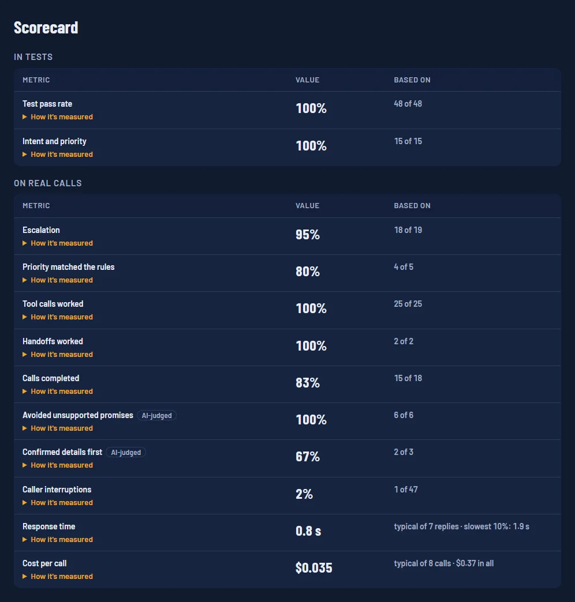
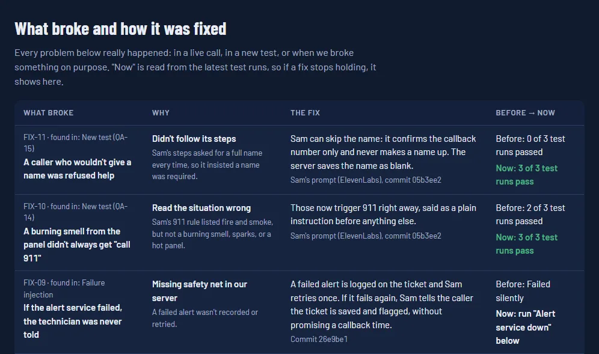

# NightAgent

**AI-powered after-hours service intake, triage, ticket lifecycle, customer follow-up, opportunity handoff, and agent evaluation.**

NightAgent is a portfolio demonstration of how an AI voice agent can support the complete after-hours service lifecycle for a physical-security integrator. Instead of stopping at a chatbot or voice demo, NightAgent connects the customer conversation to operational workflow: capture the problem, create and prioritize a service ticket, simulate dispatch and repair progression, call the customer back, verify the outcome, identify follow-up sales or service needs, and regression-test agent behavior against problems found during real demo calls.

**Live demo:** https://nightshift-dispatch.vercel.app/demo  
**Evaluation Lab:** https://nightshift-dispatch.vercel.app/lab

> **Demo note:** The customer/AI interaction demonstrates the conversational experience. Dispatch, technician assignment, repair timing, and lifecycle progression are intentionally accelerated/simulated so a recruiter or reviewer can experience an hours-long service workflow in minutes. The UI labels simulated events accordingly.

## Why I Built It

After-hours service is more than answering a phone call. A useful system has to understand what happened, determine urgency, capture enough information for service, keep the customer informed, and make sure the issue is actually resolved.

NightAgent demonstrates how AI can sit inside that workflow rather than exist as a standalone assistant. The Evaluation Lab extends that idea by showing that a production-style agent also needs repeatable evaluation: when a problem is discovered in a live conversation, it can become a regression test that protects the behavior going forward.

## Two Ways to Explore the Demo

### Simple Mode

Simple Mode is designed for a recruiter, hiring manager, customer, or business stakeholder. It keeps the experience focused on the customer journey: talk to Sam, create a ticket, follow the service lifecycle, and see the post-service callback and downstream actions.

### Engineering Mode

Engineering Mode exposes what is happening behind each conversational turn. It shows the path from caller audio through speech-to-text, agent reasoning, tool calls, deterministic business rules, persistence, voice response, and grading.

The goal is to make the implementation inspectable rather than presenting the voice agent as a black box.

```text
Caller audio
   |
   v
Speech to text
   |
   v
Agent decision
   |
   v
Tool call
   |
   v
Rules in Python/FastAPI
   |
   v
Record saved in Supabase
   |
   v
Voice response
   |
   v
Evaluation / grading
```

## The Agents

Four ElevenLabs agents share the work. The backend decides what happens; the agents talk and call tools.

| Agent | Role | Tools |
| --- | --- | --- |
| **Sam** | After-hours front desk and dispatcher: safety first, finds the account, confirms name and number, opens and prioritizes tickets, pages the on-call technician for emergencies, takes messages, and hands off to a specialist | `lookup_customer`, `create_ticket`, `page_on_call_tech`, `take_message`, `transfer_to_agent` |
| **Jordan** | Billing assistant (own voice): looks up invoices and flags possible duplicate charges; never promises a refund or credit | `billing_lookup`, `request_billing_review`, `take_message` |
| **Riley** | Sales assistant (own voice): gathers what the caller wants; never quotes a price, the account executive does | `record_sales_interest`, `take_message` |
| **Follow-up call** | Sam, in the same voice, calls the customer back after the repair and reports one structured outcome; routing rules in code decide what happens next | `record_follow_up_outcome` |

The staff behind the agents (billing contact, account executive, service manager, technicians) are fictional and labeled that way.

## Evaluation Lab

The **Evaluation Lab** measures how well the agents do, from what really happened. The page opens with a card for each section, a short note on what it's for, and a button that jumps to it:

- **Scorecard:** plain tables of how the agents perform in tests and on real calls, each number with the sample it's based on.
- **Fixes log** ("What broke & how we fixed it"): every real problem, why it happened, what changed, and whether the fix still holds in the latest runs.
- **Regression tests:** problems found in live calls (and a few unclear situations) turned into repeatable tests that run against the live ElevenLabs agents using ElevenLabs Agent Testing.
- **Failure injection:** known failures replayed on purpose through the real server code, in a sandbox.
- **Not measured yet:** what the lab can't prove yet (interruption recovery, silence, speech-to-text confidence, hallucination in general).
- **Test Inspector:** planned, not built. It will show why a single test passed or failed.

This is intentionally different from a static scripted demo. The project demonstrates an engineering feedback loop:

```text
Live conversation
   |
   v
Unexpected or incorrect behavior found
   |
   v
Create a regression test
   |
   v
Run test against the live agent
   |
   v
Inspect reply + tool behavior
   |
   v
Pass / fail result
   |
   +----> Fix agent or workflow ----> Re-test
```

### Scorecard



Two tables that are never blended, because tests are controlled and real calls aren't:

| Group | Metric | Where the number comes from |
| --- | --- | --- |
| In tests | Test pass rate | Latest run of each regression test, 3 runs per test |
| In tests | Intent and priority | The tests that check whether the agent read the situation right (emergency or not, off-topic, unclear) |
| On real calls | Escalation | Emergency tickets where the on-call technician was alerted |
| On real calls | Priority matched the rules | AI-suggested priority vs. the final priority set by code |
| On real calls | Tool calls worked / Handoffs worked | Errors in ElevenLabs' own call records |
| On real calls | Calls completed | Calls that ended with a ticket, message, or sales lead |
| On real calls | Avoided unsupported promises, Confirmed details first | Graded by ElevenLabs after each call, labeled **AI-judged** |
| On real calls | Caller interruptions | Agent replies the caller talked over (a count, not a grade) |
| On real calls | Response time | Caller stops talking → agent voice starts; typical and slowest 10% |
| On real calls | Cost per call | ElevenLabs' own dollar price recorded on each call (`cost_fiat`), not the monthly plan |

Rules the scorecard follows: every number shows how many runs or calls it's based on; with nothing to count it says "No data yet" instead of 0%; made-up demo scenarios are excluded; and caller words are never shown. Per-call cost and timing are saved once, when a call is graded, and calls nobody has opened are graded a few at a time whenever the lab page loads.

**Snapshot on 2026-10-03** (live numbers are on the lab page): 48 of 48 test runs passed; 18 of 19 real emergencies escalated; 25 of 25 tool calls worked; 15 of 18 calls completed; typical response 0.84 s; typical cost $0.035 per call. The samples are small, and the page says so next to every number.

### Current regression coverage

Sixteen tests across Sam, Jordan, and Riley, each run three times because the same model can answer differently from one run to the next.

| Test | What it protects |
| --- | --- |
| **QA-01 — Confirm identity after lookup** | Sam reads the caller's name and phone number back after account lookup and asks for confirmation. |
| **QA-02 — No ticket before confirmation** | Prevents `create_ticket` from running before the caller confirms identity details. |
| **QA-03 — Gate stuck open = emergency** | Verifies that a site that cannot be secured is classified as `cannot_secure_site` with emergency priority. |
| **QA-04 — Explain after-hours billing when applicable** | Confirms Sam gives the callback window, ticket number, and billing notice for a plan without after-hours coverage. |
| **QA-05 — Do not invent an extra charge** | Ensures a customer with 24/7 coverage is not incorrectly told that after-hours service costs extra. |
| **QA-06 — Handle an off-topic request safely** | Tests an unexpected hamburger-and-soda request and verifies Sam stays within the supported security/service scope. |
| **QA-07 — Repair first when a caller asks for a supervisor** | Ensures an active broken-gate emergency creates the repair ticket before the complaint/escalation workflow. |
| **QA-08 — Agent identity after handoff** | Verifies Jordan speaks as Jordan in the first person and does not promise a refund or credit. |
| **QA-09 — Same problem reported twice: no second alert** | When the server says the problem is already on an open ticket, Sam does not page the technician again. |
| **QA-10 — Same problem reported twice: point to the open ticket** | Sam gives the existing ticket number, says the technician already has it, and mentions no new ticket or charge. |
| **QA-11 — Riley never quotes a price** | When a caller pushes for a ballpark, Riley gives no price or estimate and says the account executive will quote. |
| **QA-12 — Riley records the lead accurately** | Riley's `record_sales_interest` call carries the device count, timeline, best time, and confirmed number the caller actually gave. |
| **QA-13 — Cat staring at the panel** | An odd but harmless report: Sam asks what's actually wrong instead of escalating, opening a ticket, or saying 911. |
| **QA-14 — Burning smell from the panel** | The other side of QA-13: a possible fire. Sam tells the caller to call 911 and stay away from the panel before anything else. |
| **QA-15 — Caller won't give a name** | Sam keeps helping with just the callback number and never makes a name up. |
| **QA-16 — Repair done, then a billing question** | Sam hands off to Jordan without asking the caller to confirm their details a second time. |

### Caught by a new test, then fixed

QA-13 to QA-16 were written to try unclear calls, and two of them failed on the first run:

| Test | First run | Why | Fix | After |
| --- | --- | --- | --- | --- |
| QA-15 Caller won't give a name | 0 of 3 passed | Sam's steps asked for a full name every time, so it said a name was required | Prompt: a caller may decline a name; confirm the number only and never invent one. Server: a declined name is saved as blank | 3 of 3 |
| QA-14 Burning smell | 2 of 3 passed | The 911 rule listed fire and smoke, but not a burning smell, sparks, or a hot panel | Prompt: those trigger 911 right away, said as a plain instruction first | 3 of 3 |

After the fix, all 13 of Sam's tests were re-run together: 39 of 39 passed, so nothing else broke. The tests were not loosened to make them pass. The wording of the post-call grader for "confirmed details first" was then updated to match, so a caller who declines a name but confirms the number isn't counted as a miss.

### Fixes log



The lab lists 11 real problems (found in live calls, new tests, or failure injection) in a table: what broke, why, the fix (a commit or an agent prompt), what was recorded before, and **now**, which is read live from the latest test runs. If a fix stops holding, its "now" line turns red. The entries live in `app/fix_log.py`, and a test checks that every entry points at real tests.

The lab evaluates both **reply behavior** and **tool behavior**. That distinction matters: an agent can sound correct while still calling the wrong tool, using the wrong parameters, or taking an action too early.

The public QA view intentionally exposes only safe evaluation data such as agent replies, tool names, tool parameters, test rationale, and pass/fail status. Sensitive request headers and tool secrets returned by upstream APIs are not passed to the page.

### Failure injection

The lab can also break things on purpose. Each scenario replays a known failure through the real server code inside a sandbox (a throwaway in-memory store for that one request), so nothing reaches the live ticket board and no real texts are sent. Each run lists what happened and the checks it passed.

| Scenario | What used to happen | What happens now |
| --- | --- | --- |
| **Same caller twice** | A second call about the same broken gate opened a duplicate ticket and told Sam to page the technician again. | The call joins the open ticket (same account or callback number, same problem, opened in the last 12 hours), priority can only go up, Sam is told not to page again, and a second page is refused even if requested. |
| **Alert service down** | A paging error crashed the tool call: Sam got a bare error and the ticket history never showed the alert failed. | The tool answers with `alert_failed`, the failure is recorded on the ticket, Sam is told not to promise a callback time, and a retry works once the service is back. |

Both "before" behaviors were reproduced by running the same scenario against the earlier code. The voice side of the duplicate-caller fix is covered by QA-09 and QA-10.

### Not measured yet

The page says what it can't measure instead of showing a perfect-looking dashboard:

- **How Sam recovers when interrupted.** Interruptions are counted, but grading the recovery needs tests with real audio; ElevenLabs tests are text.
- **Silence.** What Sam does when a caller goes quiet also needs a real voice call.
- **Speech-to-text confidence.** ElevenLabs doesn't provide a confidence score per caller turn.
- **Hallucination in general.** One specific kind is measured, promises the tools didn't back up, and it's named that.

## End-to-End Workflow

1. **Customer calls the after-hours AI agent** and describes a security-system problem.
2. **AI gathers context** such as customer/account information, affected system, symptoms, and safety information.
3. **A service ticket is created** with a ticket number, issue classification, and rules-based priority.
4. **The ticket enters the service lifecycle** and progresses through notification, assignment, travel, arrival, repair, and check-in stages.
5. **NightAgent follows up with the customer** after the simulated repair to verify that the system is working.
6. **The customer can report that the problem remains**, allowing the workflow to continue instead of treating technician completion as proof of resolution.
7. **Additional needs are captured.** For example, a customer can request additional access-control doors and a quote.
8. **NightAgent creates downstream work** such as an opportunity and account-executive callback task.
9. **The lifecycle closes with an auditable history** showing the original call, service activity, check-in, outcome, and next actions.
10. **Agent behavior is measured and regression-tested.** A scorecard tracks tests and real calls separately, issues discovered during calls become repeatable tests, every fix is logged with its live retest result, and known failures are replayed on purpose through failure injection.

## Screenshots

### 1. After-hours AI intake and live ticket board
The customer starts an after-hours call with Sam while the ticket board provides an operational view of current service requests.


### 2. Conversational account and issue discovery
The agent gathers customer/account information and asks what is happening with the security system.


### 3. AI conversation creates a service ticket
Information collected during the call becomes a structured service request visible on the ticket board.


### 4. Accelerated service lifecycle
Demo mode moves the ticket through an intentionally accelerated workflow so the complete service lifecycle can be evaluated without waiting hours for a real dispatch.


### 5. Technician progression and operational timeline
The ticket records simulated notification, technician assignment, travel, arrival, and subsequent service events as a timeline.


### 6. Post-service AI check-in
After the repair stage, NightAgent initiates a customer check-in rather than assuming that a completed technician visit means the problem is solved.


### 7. Follow-up needs captured during the conversation
The customer can ask for additional help during the follow-up—for example, requesting more access-control doors and a quote.


### 8. Service-to-sales handoff
NightAgent turns a newly discovered customer need into downstream action instead of allowing it to disappear inside a service conversation.


### 9. Closed-loop lifecycle
The final ticket view connects the service outcome with next actions, including an access-control expansion opportunity and account-executive follow-up tasks.


## What the Project Demonstrates

- Conversational AI applied to a real business workflow
- ElevenLabs voice-agent integration
- Simple stakeholder view plus inspectable Engineering Mode
- After-hours customer intake
- Physical-security service triage
- Structured ticket creation from natural-language conversations
- Rules-based service prioritization
- Tool calling with deterministic business logic
- Multi-agent handoffs: a front-desk agent passing billing and sales callers to specialist agents with their own voices
- Human/service-team handoff through messages for the right department
- Stateful ticket lifecycle tracking
- Customer follow-up after service
- Resolution verification rather than simple ticket completion
- Identification of additional customer needs
- Service-to-sales opportunity creation
- Account Executive follow-up tasks
- An evaluation scorecard from tests and real calls, with sample sizes and per-call cost
- A fixes log: problem, cause, fix, and live retest result
- Regression testing based on failures found in live calls
- Reply-level and tool-level agent evaluation
- Multi-agent QA coverage for Sam, Jordan, and Riley
- Failure injection in a sandbox: duplicate callers and a paging outage
- Safe public presentation of test results without exposing tool secrets
- Clear separation between AI behavior and simulated demo events
- Recruiter-friendly visualization of an end-to-end AI workflow

## Safety, Privacy, and Limits

- **Safety first.** Sam tells a caller to hang up and call 911 for fire, smoke, a burning smell, sparks, a break-in in progress, or anyone in danger, before asking anything else. Sam never asks for or repeats alarm codes and never explains how to bypass a system.
- **Code sets the priority.** The agent suggests a priority, but rules in Python decide. The model can raise a ticket's priority; it can never downgrade an emergency.
- **Locked-down tools.** Every tool endpoint requires a shared secret sent by the agent. The agents only accept calls from approved websites.
- **Caps on the public demo.** Calls end after 5 minutes, each agent takes at most 3 calls at once and 40 a day, and scenarios and follow-up calls are capped per hour. Paging the technician is simulated.
- **Nothing private on public pages.** Phone numbers on the ticket board are masked, Engineering Mode shows word counts instead of the caller's words, and the Evaluation Lab strips the tool secret that ElevenLabs returns with test results.
- **Made-up data.** Demo customers, invoices, and staff are fictional. Please don't share real names, numbers, or alarm codes on the demo.

## Physical-Security Context

The demo scenarios are based on the kinds of problems a security integrator encounters in the field, including:

- Access-control doors or badges not working
- Main entrances that will not unlock
- Cameras stopping after a power outage
- Gates or doors stuck open
- After-hours coverage and escalation questions
- Multi-door access-control expansion requests

This is intentional: NightAgent combines my physical-security / Sales Engineering background with AI application development rather than demonstrating AI with a generic use case.

## Architecture Concept

```text
Customer
   |
   v
ElevenLabs Voice Agent
   |
   +--> Customer & account identification
   +--> Problem discovery
   +--> Safety / urgency questions
   +--> Tool calls
   |
   v
Python / FastAPI Service Workflow
   |
   +--> Ticket creation
   +--> Classification
   +--> Rules-based priority
   +--> Dispatch / assignment lifecycle
   +--> Status timeline
   |
   v
Supabase Persistence
   |
   v
Post-Service AI Check-In
   |
   +--> Confirm resolved -----------------> Close ticket
   |
   +--> Still broken ---------------------> Continue service workflow
   |
   +--> Additional need -----------------> Opportunity + AE task

Specialists (ElevenLabs transfer_to_agent)
   |
   +--> Jordan: billing ------------------> Billing review request
   +--> Riley: sales ---------------------> Sales lead + AE task

Engineering feedback loop
   |
   +--> Live-call problem
   +--> ElevenLabs Agent Testing regression case
   +--> Reply/tool evaluation
   +--> Pass/fail result in Evaluation Lab
```

## Technology Stack

- **ElevenLabs Agents** — real-time conversational voice experience and agent testing
- **Python** — service orchestration and business logic
- **FastAPI** — API/tool endpoints used by the agents and demo
- **Supabase** — persisted ticket, lifecycle, and demo records
- **Vercel** — public demo hosting
- **ElevenLabs Agent Testing** — regression suites against live agents
- **Rules-based decision logic** — deterministic priority and workflow behavior where business rules should control the outcome
- **pytest and headless Chrome** — a backend test suite, plus browser test scripts in `e2e/`

## Run It Locally

```bash
python -m venv .venv
.venv/Scripts/pip install -r requirements.txt      # macOS/Linux: .venv/bin/pip
.venv/Scripts/python -m pytest -q                  # backend tests, no keys needed
TOOL_SECRET=local-test .venv/Scripts/python -m uvicorn main:app --port 8765
```

Then open http://127.0.0.1:8765/demo and http://127.0.0.1:8765/lab. Settings come from environment variables (or a `.env` file):

| Variable | Needed for |
| --- | --- |
| `TOOL_SECRET` | Protecting the tool endpoints the agents call |
| `SUPABASE_URL`, `SUPABASE_SERVICE_KEY` | Saving to Supabase. Without them the app uses an in-memory store, so everything works but resets on restart |
| `ELEVENLABS_API_KEY` | Reading test results and call grades for the Evaluation Lab (a read-only key is enough) |
| `ELEVENLABS_AGENT_ID`, `FOLLOWUP_AGENT_ID` | Pointing the demo page at your own agents |

The live agents only accept calls from the approved websites, so voice calls from a local copy need your own ElevenLabs agents. The ticket board, Demo Mode, the lab page, and the tests all work locally. The database schema is in `supabase/`, and `scripts/export_elevenlabs.py` backs up the agents, tools, and tests (secrets redacted) into `elevenlabs/`.

## Product Design Decisions

**AI does not determine everything.** The interface explicitly communicates when business rules—not the AI—set service priority.

**Simulation is labeled.** Technician assignment and time-based service progression are fictional demo events and are identified as simulated in the application.

**Completion is not the same as resolution.** NightAgent checks with the customer after service to determine whether the problem was actually fixed.

**Service conversations can contain revenue signals.** A customer mentioning additional doors, upgrades, or another need can become structured follow-up instead of an untracked comment.

**Agent failures become tests.** Problems found while exercising the live agent are converted into regression cases instead of being treated as one-off prompt fixes.

**Words and actions are tested separately.** The Evaluation Lab checks both what an agent says and what tools it calls, including important parameters and action order.

**The lifecycle matters more than the chatbot.** The goal is to demonstrate orchestration across intake, operations, customer experience, sales, and AI quality—not simply an AI conversation window.

## Business Value

NightAgent explores how an integrator could reduce after-hours response friction while improving the quality of information handed to technicians. The same workflow can also improve customer communication and preserve sales opportunities discovered during service interactions.

The evaluation layer addresses a second business problem: conversational agents change as prompts, tools, and workflows evolve. Regression testing provides a way to verify that important behaviors—identity confirmation, emergency handling, billing language, escalation order, and agent identity—continue to work after those changes.

The concept is particularly relevant to security integrators, managed service providers, field-service organizations, and other businesses where an incoming customer problem must move through multiple people and systems before it is truly resolved.

## Portfolio Focus

NightAgent was built as an applied AI workflow project demonstrating the intersection of:

**AI + Voice Agents + Agent Evaluation + Physical Security + Customer Experience + Service Operations + Sales Engineering**

The project is designed to show how I approach a business problem from the initial customer interaction through operational execution, measurable next actions, and repeatable QA—not just how to connect an LLM to a user interface.
